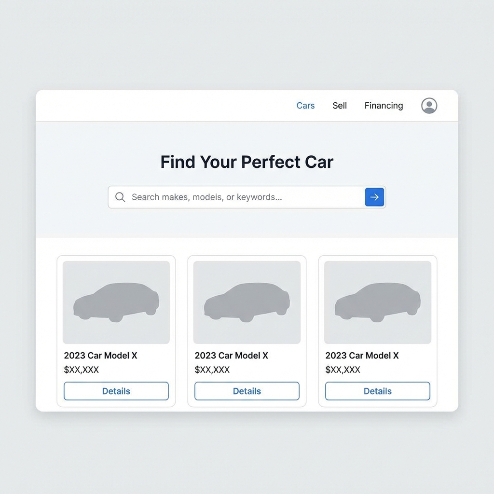

# Buying: How to Search Cars for Sale

## Overview
Searching for a car on **AUTO.AE** is designed to be as intuitive as using a search engine. Whether you have a specific dream car in mind or just want to browse within a budget, the "Buy" marketplace offers tools to help you find the right vehicle quickly.

## Table of contents
*   [What this page covers](#what-this-page-covers)
*   [Key concepts explained](#key-concepts-explained)
*   [Step-by-step guide](#step-by-step-guide)
*   [Visual example](#visual-example)
*   [Important tips](#important-tips)
*   [Common mistakes](#common-mistakes)
*   [Related pages](#related-pages)
*   [Next step](#next-step)

## What this page covers
*   Accessing the "Buy a Car" section.
*   Using the Quick Search bar.
*   Sorting results by price and date.

## Key concepts explained
| Term | Definition |
| :--- | :--- |
| **Grid View** | The default layout showing large photos of cars. |
| **List View** | A compact layout showing more details per row. |
| **Sort By** | Reordering the list (e.g., "Lowest Price First" or "Newest Listed"). |

## Step-by-step guide

### 1. Select the "Buy" Tab
Ensure you are in the correct marketplace by clicking **"Buy a Car"** in the main header or app navigation.

### 2. Enter Keywords
Use the main search bar to type anything:
*   *Brand:* "Toyota"
*   *Model:* "Land Cruiser"
*   *Features:* "Sunroof", "Leather"
*   *Press Enter* to see initial results.

### 3. Browse and Sort
Once the results load, use the "Sort" dropdown (usually top right) to organize them:
*   **Price: Low to High** – Good for finding bargains.
*   **Price: High to Low** – Good for finding luxury/premium trims.
*   **Most Recent** – Crucial for catching fresh deals before they sell.

### 4. Click to View
Click on any car card to open the full listing page.

## Visual example

*Figure 1: The main search interface showing the keyword bar and sorting options.*

## Important tips
*   **Save Your Search:** If you don't find what you want today, click the "Bell" icon to get notified when new cars match your search.
*   **Check the Date:** Look at the "Listed" date. Cars listed > 3 months ago might be sold or have negotiable prices.

## Common mistakes
*   **Searching in "Rent":** Ensure you didn't accidentally click the "Rent" tab, or you will see daily rates instead of sales prices.
*   **Typing too much:** Instead of "I want a red car", just type "Red". The search is keyword-based.

## Related pages
*   [Buying: Filters Explained](12_Filters_Explained.md)
*   [Platform: AUTO.AE Marketplace Overview](../Platform/3_AUTO_AE_Marketplace_Overview.md)

## Next step
*   [Master the Advanced Filters](12_Filters_Explained.md)

---
*Last updated: January 2026*
