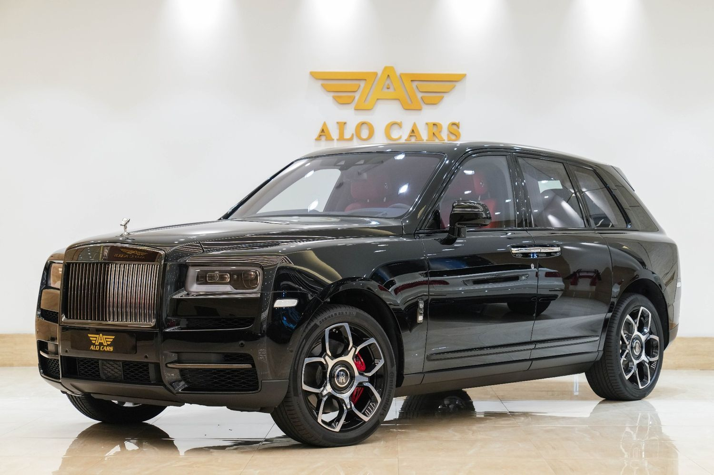

# Buying: Car Listing Page Overview

## Overview
The listing page is the single source of truth for every vehicle on **AUTO.AE**. It aggregates all the information provided by the seller, including photos, technical specifications, and contact details. Learning to read this page correctly ensures you don't miss key details.

## Table of contents
*   [What this page covers](#what-this-page-covers)
*   [Key concepts explained](#key-concepts-explained)
*   [Anatomy of a Listing](#step-by-step-guide)
*   [Visual example](#visual-example)
*   [Important tips](#important-tips)
*   [Common mistakes](#common-mistakes)
*   [Related pages](#related-pages)
*   [Next step](#next-step)

## What this page covers
*   Understanding the "Key Specs" block.
*   Checking the Seller Profile.
*   Reading the Price History chart.

## Key concepts explained
| Term | Definition |
| :--- | :--- |
| **VIN** | Vehicle Identification Number. A unique 17-character code to track the car's history. |
| **Seller Note** | The free-text description written by the owner. |
| **Badges** | Icons like "Accident Free", "First Owner", or "Under Warranty". |

## Anatomy of a Listing

### 1. Header & Title
Referencing a real example: **Rolls-Royce Cullinan Black Badge I (2023)**
*   **Price:** 1,580,000 AED
*   **Badges:** Look for "Dealer maintained" and "Urgent" tags right below the title.

### 2. Key Specifications (The Grid)
This section defines the car's DNA. Example data:
*   **Odometer:** 800 km (Low mileage)
*   **Specs:** GCC Specs (Preferred)
*   **Engine:** 6.7L, 600 hp, Petrol
*   **Drivetrain:** AWD (All-Wheel Drive)
*   **Color:** Black / Trim Individual

### 4. Description
The seller's personal text. This often contains details about modifications, service history, or reasons for selling.

### 5. Seller Card
Located on the right (desktop) or bottom (mobile). Shows:
*   Seller Name (or Showroom Name).
*   Member since date.
*   Link to view their other listings.

## Visual example

*Figure 1: A real example of a high-quality listing on AUTO.AE.*

## Important tips
*   **Check the Map:** The bottom of the page usually shows a map pin. Confirm if the car is in a convenient location before calling.
*   **Save for Later:** Use the "Heart" icon to save the car to your Garage.

## Common mistakes
*   **Skipping the Options List:** Below the description, there is a long checklist of features (e.g., "360 Camera", "Heads Up Display"). Check this to confirm if the car has the specific tech you need.

## Related pages
*   [Buying: How to Contact a Seller](14_How_to_Contact_a_Seller.md)
*   [Buying: VIN and History Basics](16_VIN_and_History_Basics.md)

## Next step
*   [Learn how to contact the seller](14_How_to_Contact_a_Seller.md)

---
*Last updated: January 2026*
