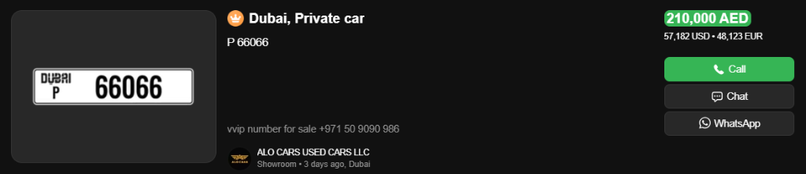

# VIP Plates: What Are VIP Plates?

## Overview
In the UAE, a car license plate is more than just a registration identifier; it is a status symbol and an investment asset. **VIP Plates** are special license numbers (e.g., "A 1", "F 55555") that are traded on the open market, often costing more than the cars they are attached to. **AUTO.AE** is the premier marketplace for buying and selling these assets.

## Table of contents
*   [What this page covers](#what-this-page-covers)
*   [Key concepts explained](#key-concepts-explained)
*   [The Market Logic](#step-by-step-guide)
*   [Visual example](#visual-example)
*   [Important tips](#important-tips)
*   [Related pages](#related-pages)
*   [Next step](#next-step)

## What this page covers
*   Difference between Normal and Distinction plates.
*   Why some numbers cost millions.
*   Emirate-specific designs (Dubai vs Abu Dhabi).

## Key concepts explained
| Term | Definition |
| :--- | :--- |
| **Digit Count** | The fewer digits, the higher the price. 1-digit (e.g., "5") is the holy grail. 5-digits are common unless they are repetitive. |
| **Code / Series** | The letter prefix. In Dubai, "A" is the oldest and most prestigious code. New codes like "W" or "X" are generally cheaper. |

## The Market Logic

### 1. Digits Matter Most
*   **1-Digit:** (e.g., "7") - Millions of Dirhams. Usage: Royals & VVIPs.
*   **2-Digit:** (e.g., "20") - Millions.
*   **3-Digit:** (e.g., "123") - Hundreds of thousands.
*   **4-Digit:** (e.g., "1000") - Tens of thousands.
*   **5-Digit:** (e.g., "82746") - Standard (Free/Cheap), unless repetitive (e.g., "55555").

### 2. The Pattern Factor
Humans love patterns.
*   **Repeated:** 77777 (Super expensive).
*   **Sandwich:** 101 or 505.
*   **Ascending:** 12345.

### 3. Investment Value
Unlike cars, which depreciate, VIP plates often appreciate in value over time. They are liquid assets that can be sold quickly.

## Visual example

*Figure 1: Each Emirate has its own design. A Dubai "A 55" is totally different from an Abu Dhabi "1 - 55".*

## Important tips
*   **Ownership is Forever:** Once you buy a plate, it is yours for life. You can transfer it to any car you own or sell it later.
*   **Emirate Restrictions:** A Dubai plate must be registered on a car with a Dubai file. You cannot put a Dubai plate on a car registered in Abu Dhabi generally (exceptions apply with complex transfers).

## Related pages
*   [VIP Plates: Browsing Plates](36_Browsing_Plates.md)
*   [VIP Plates: Plate Pricing Factors](41_Plate_Pricing_Factors.md)

## Next step
*   [Learn how to search for your lucky number](36_Browsing_Plates.md)

---
*Last updated: January 2026*
